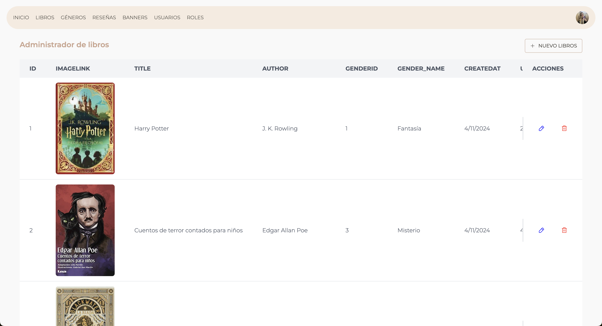

# Proyecto de Gestión de Libros 
_En el readme de back más info_

Este proyecto es una API para la gestión de libros y reseñas, construida con Node.js, Express y MySQL. Permite realizar operaciones CRUD (Crear, Leer, Actualizar y Eliminar) en una base de datos de libros.

Actualmente solo está hecho gestión de libros. 

## Uso de Postman

Puedes usar [Postman](https://www.postman.com/) para interactuar con la API. Importa la colección de Postman que contiene las solicitudes para gestionar los libros:

[Postman Collection - Books Admin](https://www.postman.com/nativegaifts24/ifts24-back/collection/kpgsybx/books-admin)

Ejemplo: Más en el readme de back

### Endpoints Disponibles

- **GET `/api/books`**: Obtener todos los libros.
- **GET `/api/books/:id`**: Obtener un libro por ID.
- **POST `/api/books`**: Crear un nuevo libro.
- **PUT `/api/books/:id`**: Actualizar un libro existente.
- **DELETE `/api/books/:id`**: Eliminar un libro.

# 📚 Book Reviews Website
_En el readme de front más data_

https://bookreview-ifts24.vercel.app/

Este proyecto es una página de recomendaciones y reseñas de libros, desarrollada con JavaScript Vanilla, HTML y CSS. Los usuarios pueden iniciar sesión, leer reseñas de libros y dejar sus propias reseñas. El objetivo de la aplicación es compartir opiniones y calificaciones sobre libros de una manera intuitiva y visualmente atractiva.

## 🖥️ Capturas
Ejemplo: Más en el readme de back
  