# Proyecto de Gestión de Libros

Este proyecto es una API para la gestión de libros y reseñas, construida con Node.js, Express y MySQL. Permite realizar operaciones CRUD (Crear, Leer, Actualizar y Eliminar) en una base de datos de libros.

Actualmente solo está hecho gestión de libros. 

## Requisitos

Antes de comenzar, asegúrate de tener instalados los siguientes programas en tu máquina:

- [Node.js](https://nodejs.org/) (versión 12 o superior)
- [MySQL](https://www.mysql.com/) (versión 5.7 o superior)
- [Postman](https://www.postman.com/) (opcional, para realizar pruebas de la API)

## Configuración del Proyecto

1. **Clonar el repositorio**:

   ```bash
   git clone <URL del repositorio>
   cd nombre-del-repositorio
   ```

2. **Instalar las dependencias**:

   Navega al directorio del proyecto y ejecuta:

   ```bash
   npm install
   ```

3. **Configurar la base de datos**:

   - Crea una base de datos en MySQL llamada `book-review`.
   - Ejecuta el siguiente script SQL para crear la tabla de libros:

     ```sql
     CREATE TABLE `book-review`.books (
         id BIGINT UNSIGNED auto_increment NOT NULL,
         title varchar(255) NOT NULL,
         coverLink TEXT NULL,
         author varchar(255) NULL,
         gender varchar(255) NULL,
         CONSTRAINT books_pk PRIMARY KEY (id)
     )
     ENGINE=InnoDB
     DEFAULT CHARSET=utf8mb4
     COLLATE=utf8mb4_0900_ai_ci
     COMMENT='Base de datos de libros para visualizar en el front de la web. A su vez, la posibilidad de crear, editar y eliminar libros.';
     ```

4. **Configurar la conexión a la base de datos**:

   Asegúrate de que el archivo de conexión a la base de datos esté configurado correctamente. Modifica el archivo `database/index.js` (o como lo hayas nombrado) con las credenciales correctas de tu base de datos MySQL:

   ```javascript
   import mysql from 'mysql2/promise';

   export const connection = await mysql.createConnection({
     host: 'localhost',
     user: 'root',
     database: 'book-review'
   });
   ```

5. **Iniciar el servidor**:

   Para iniciar el servidor, utiliza uno de los siguientes comandos:

   - Para ejecutar en modo desarrollo (con nodemon):

     ```bash
     npm run dev
     ```

   - Para ejecutar en producción:

     ```bash
     npm start
     ```

   El servidor se ejecutará en `http://localhost:3000`.


## Endpoints

### Auth
| Método | Endpoint          | Descripción                   |
|--------|-------------------|-------------------------------|
| POST   | `/api/users/register` | Registrar un nuevo usuario.     |
| POST   | `/api/users/login`    | Iniciar sesión de un usuario.   |

### Users
| Método | Endpoint           | Descripción                                            |
|--------|--------------------|--------------------------------------------------------|
| GET    | `/api/users`        | Obtener todos los usuarios.                            |
| GET    | `/api/users/details`| Obtener los detalles del usuario autenticado.          |
| PUT    | `/api/users/details`| Actualizar los detalles del usuario autenticado.       |
| DELETE | `/api/users/details`| Eliminar el usuario autenticado.                       |

### Books
| Método | Endpoint          | Descripción                        |
|--------|-------------------|------------------------------------|
| GET    | `/api/books`       | Obtener todos los libros.          |
| GET    | `/api/books/:id`   | Obtener un libro por ID.           |
| POST   | `/api/books`       | Crear un nuevo libro.              |
| PUT    | `/api/books/:id`   | Actualizar un libro existente.     |
| DELETE | `/api/books/:id`   | Eliminar un libro.                 |

### Reviews
| Método | Endpoint                 | Descripción                                |
|--------|--------------------------|--------------------------------------------|
| GET    | `/api/reviews`            | Obtener todas las reseñas.                 |
| GET    | `/api/reviews/:id`        | Obtener una reseña por ID.                 |
| POST   | `/api/reviews`            | Crear una nueva reseña.                    |
| PUT    | `/api/reviews/:id`        | Actualizar una reseña existente.           |
| DELETE | `/api/reviews/:id`        | Eliminar una reseña por ID.                |
| DELETE | `/api/reviews/archive/:id`| Archivar una reseña por ID.                |


## Uso de Postman

Puedes usar [Postman](https://www.postman.com/) para interactuar con la API. Importa la colección de Postman que contiene las solicitudes para gestionar los libros:

[Postman Collection - Books Admin](https://www.postman.com/nativegaifts24/ifts24-back/collection/kpgsybx/books-admin)

## Capturas de Pantalla

### Books


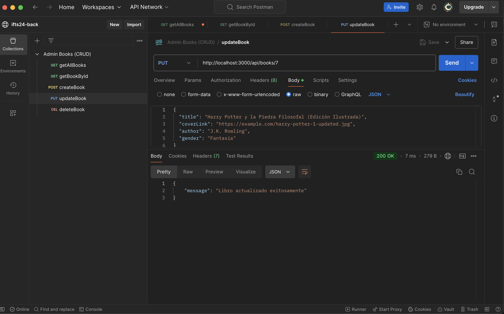


### Reviews
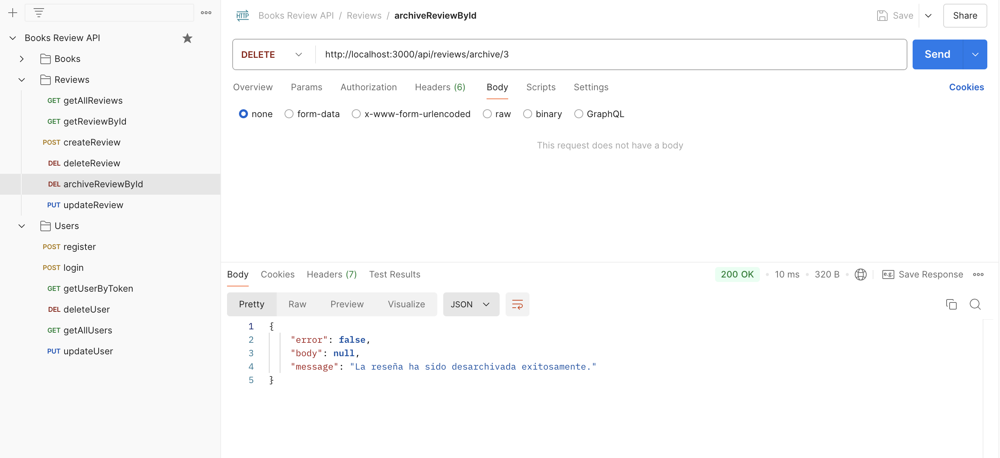
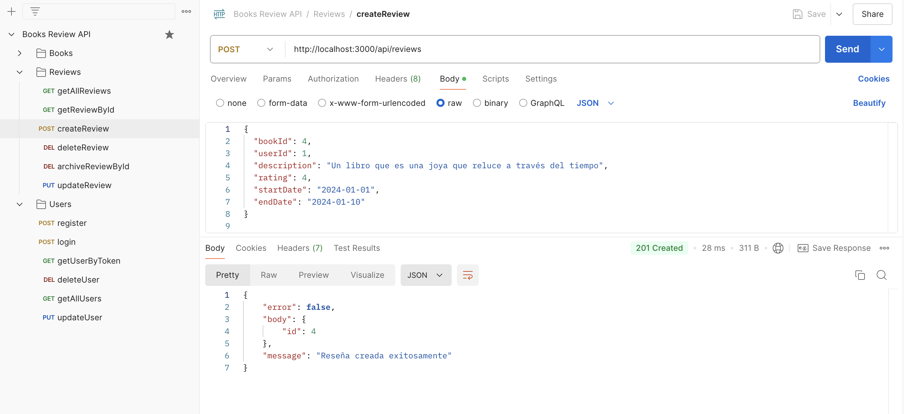
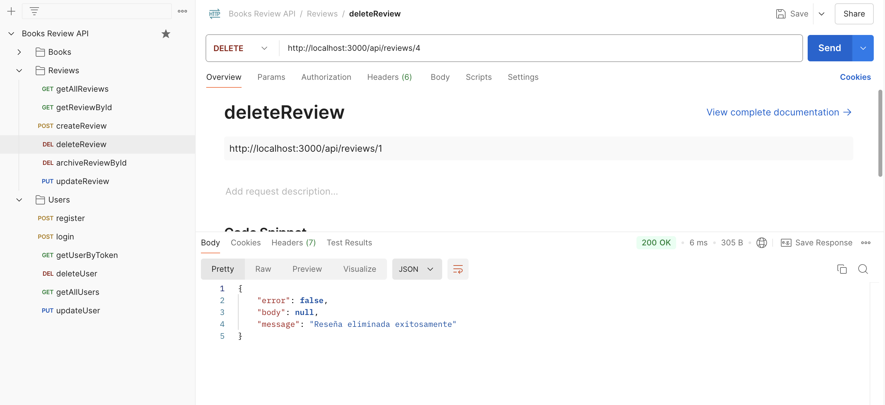
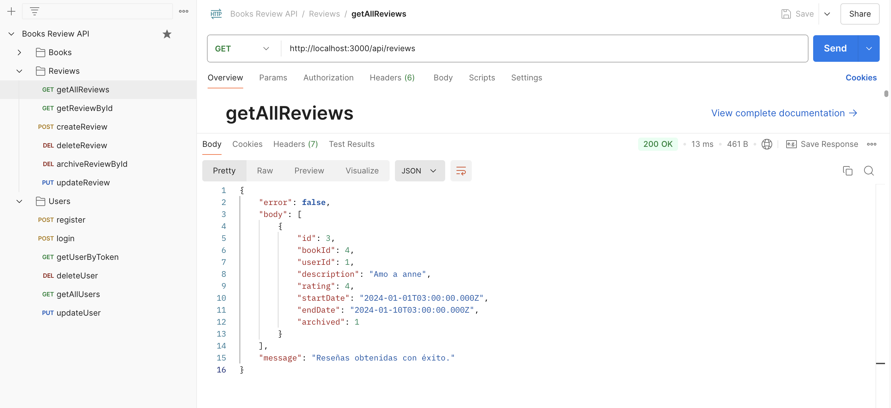
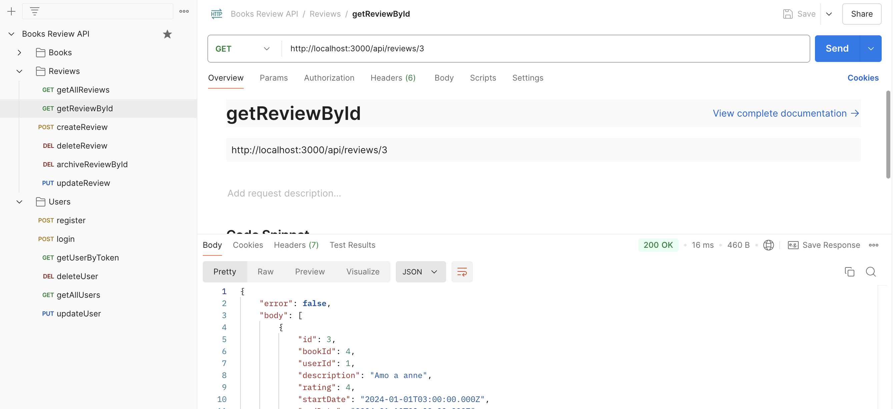
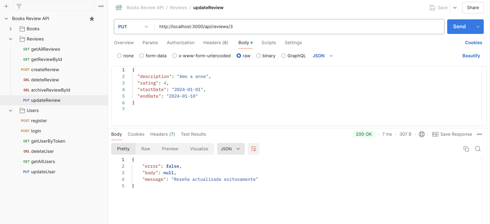

### Users
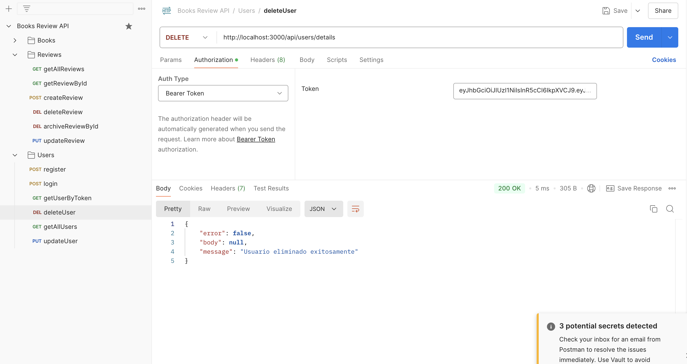
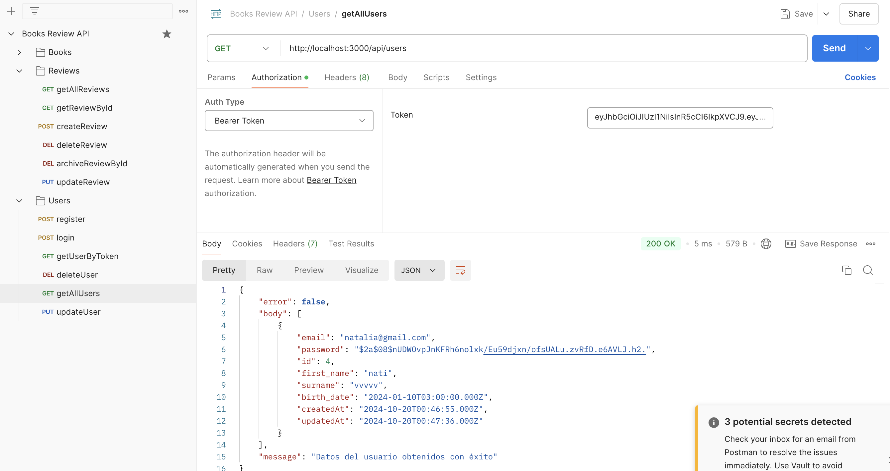
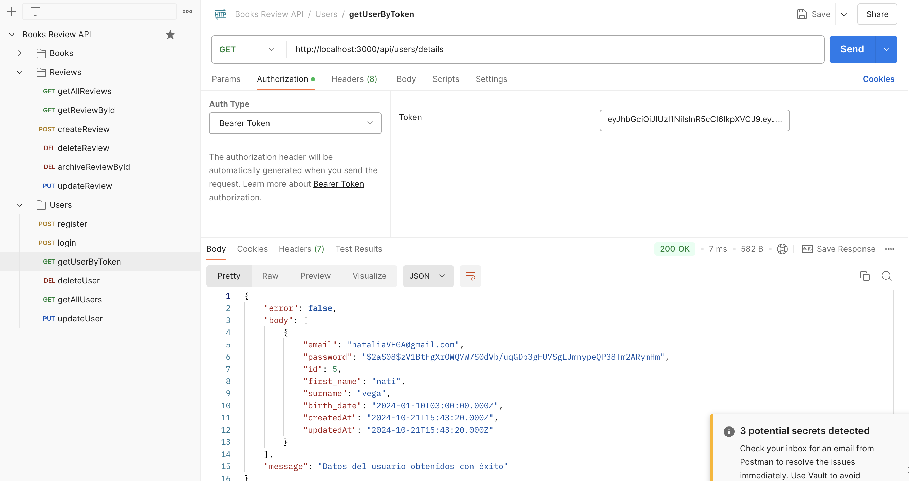
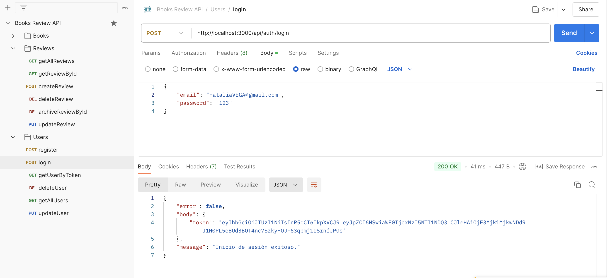
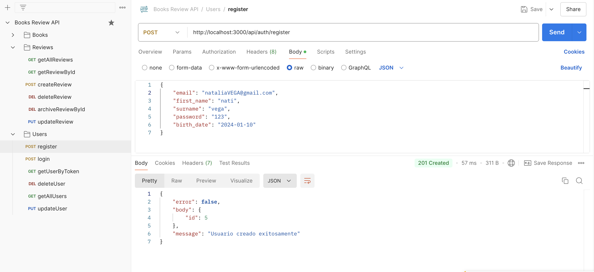
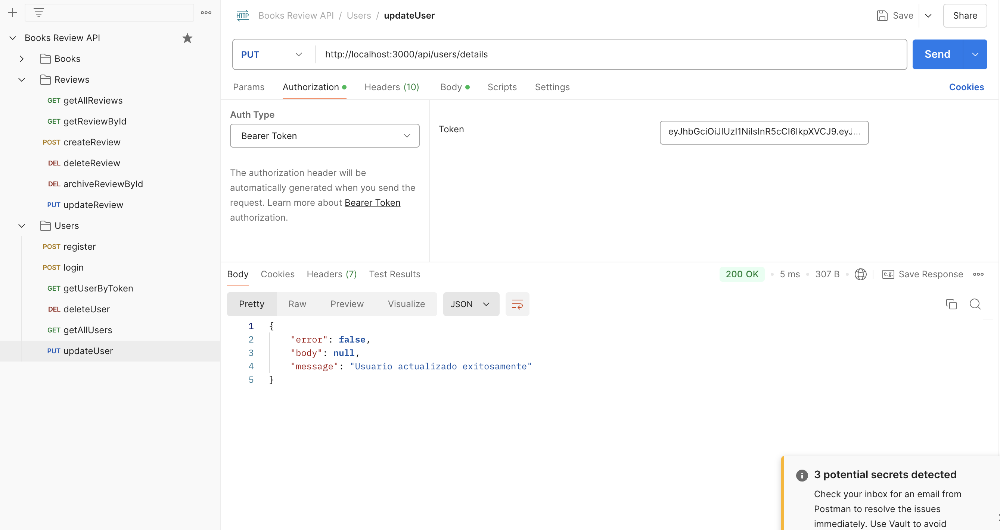
