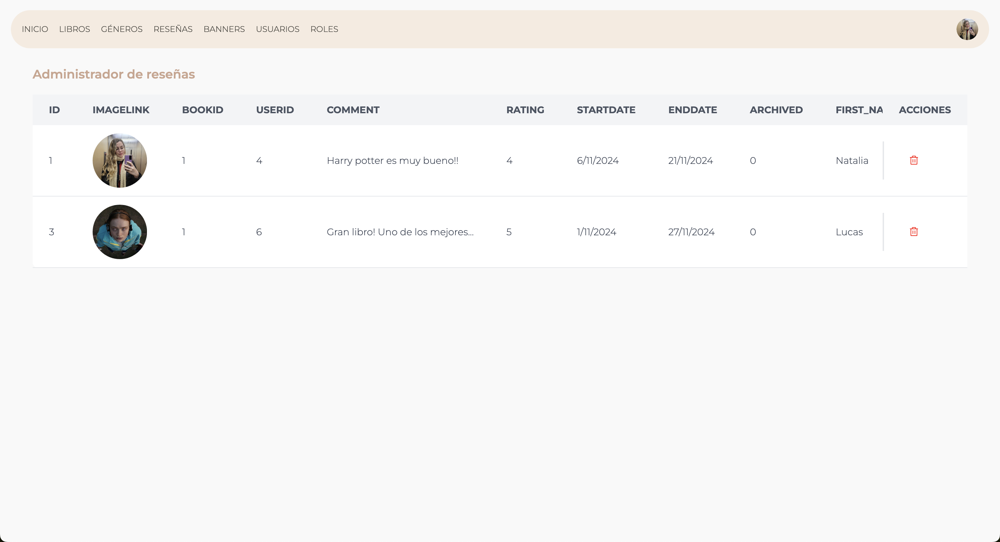
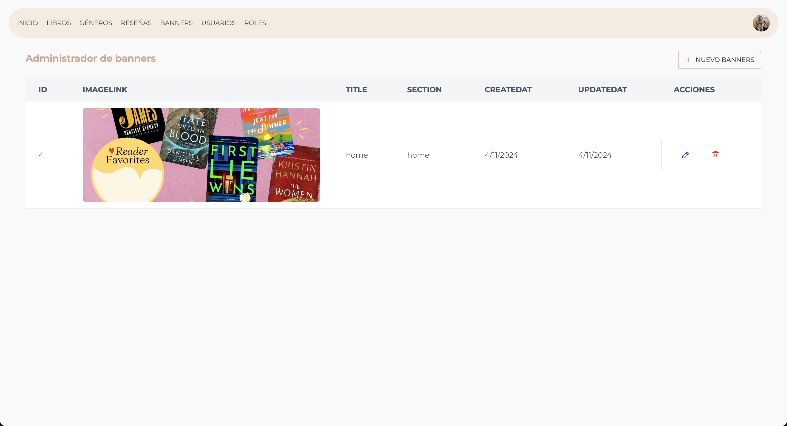
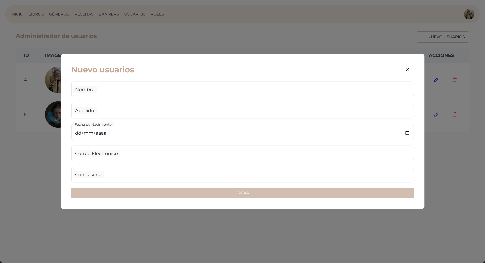
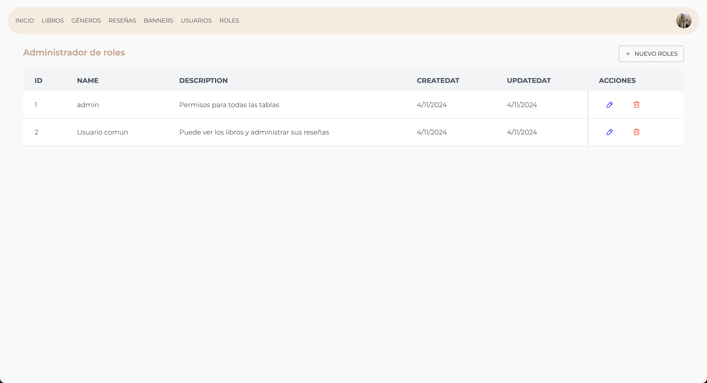
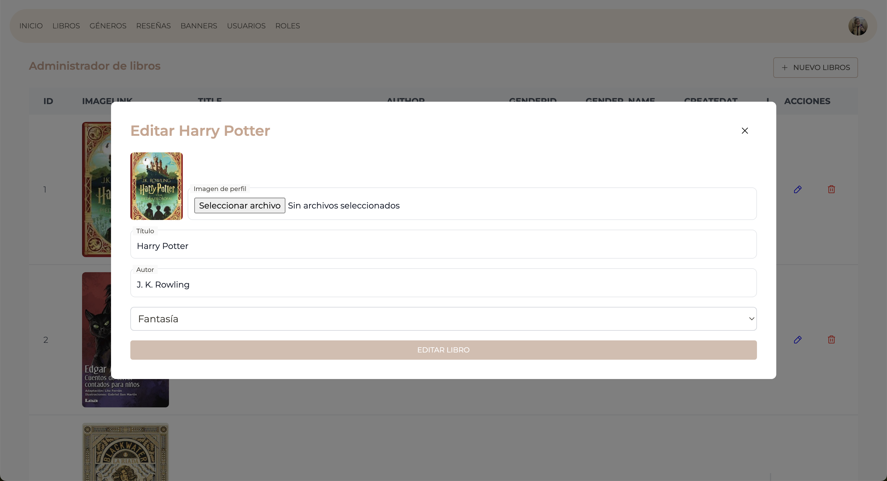
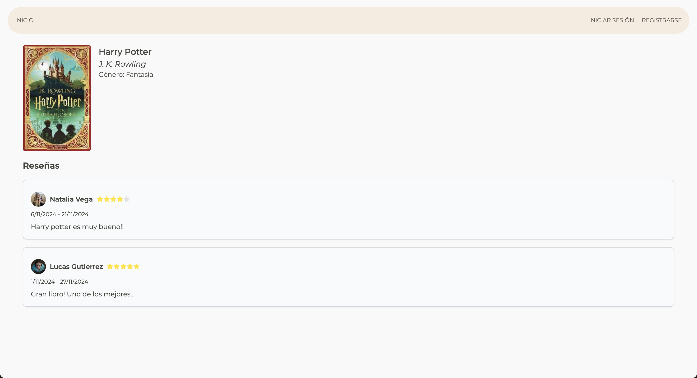
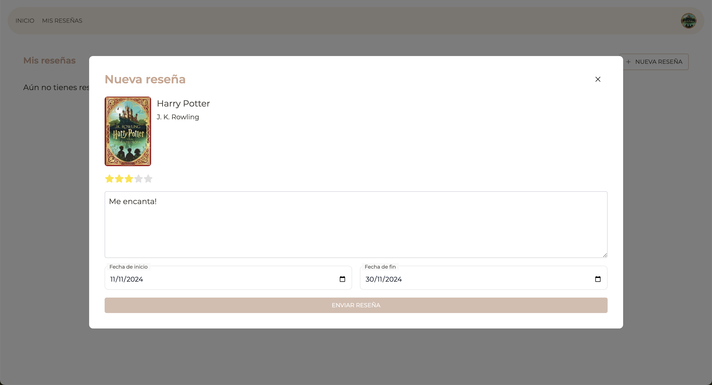
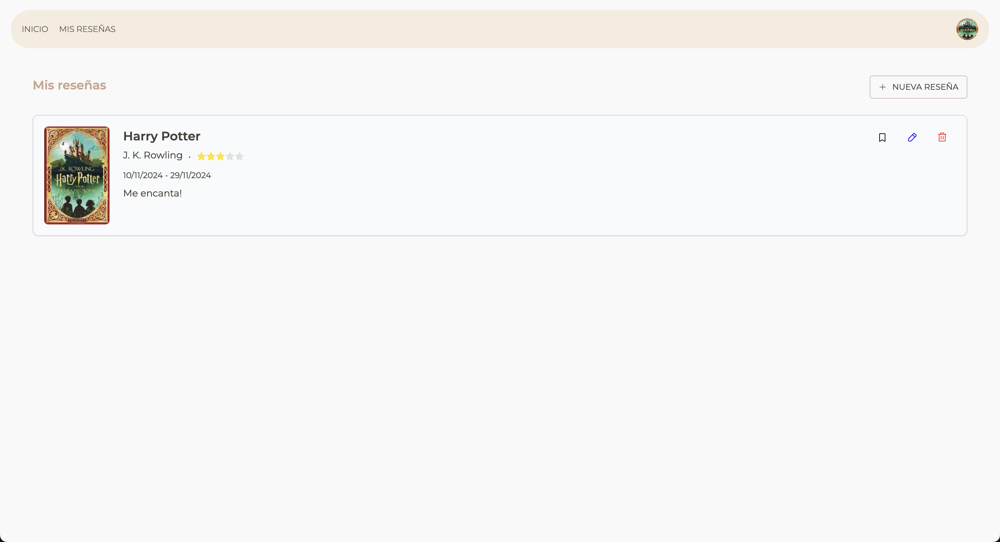

# 📚 Book Reviews Website
https://bookreview-ifts24.vercel.app/

Este proyecto es una página de recomendaciones y reseñas de libros, desarrollada con NextJS. Los usuarios pueden iniciar sesión, leer reseñas de libros y dejar sus propias reseñas. El objetivo de la aplicación es compartir opiniones y calificaciones sobre libros de una manera intuitiva y visualmente atractiva.
En este proyecto no se evalúo front-end, sino la funcionalidad de la página y la interacción con las apis.

## 🚀 Características
Tenemos 3 tipos de usuarios:
- **Usuario no registrado**: Puede ver las reseñas de los libros.
- **Usuario registrado**: Puede ver las reseñas de los libros y dejar su propia reseña.
- **Administrador**: Puede gestionar todas las tablas de la base de datos.

## 📝 Estructura del Proyecto

La estructura básica del proyecto es la siguiente:

```
├── components/       # Componentes de la aplicación.
├── pages/            # Páginas de la aplicación.
├── public/           # Archivos estáticos de la aplicación.
├── styles/           # Estilos globales de la aplicación.
├── utils/            # Funciones y utilidades de la aplicación.
├── README.md         # Descripción del proyecto.
```

## Tecnologías utilizadas
- **Next JS**
- **Tailwind**
- **FlowBite**
- **TypeScript**
- **ESLint**
- **Zustand**
- **Sooner**
- **Phospor**

## Información adicional
El deploy lo hice en Vercel conectando la cuenta a github.
Apoyo en FlowBite para los estilos de los inputs.

## Capturas de pantalla










